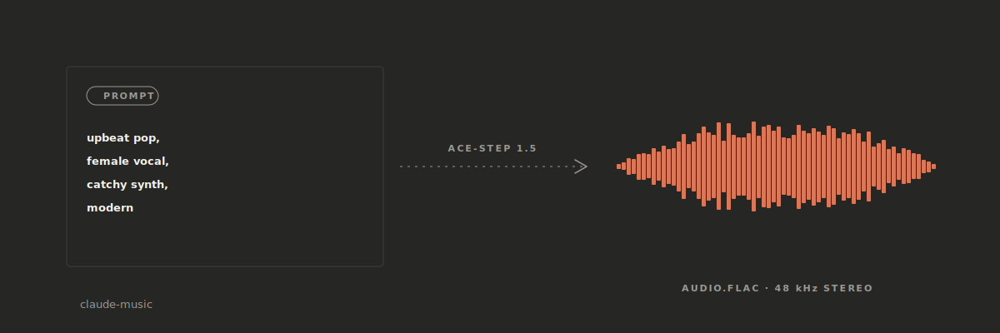
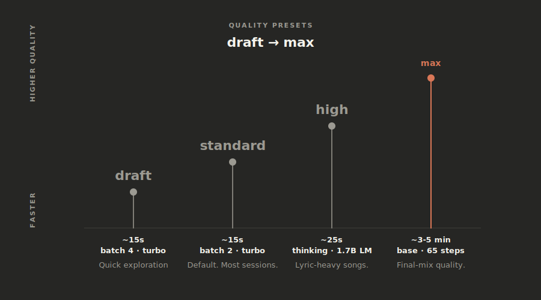
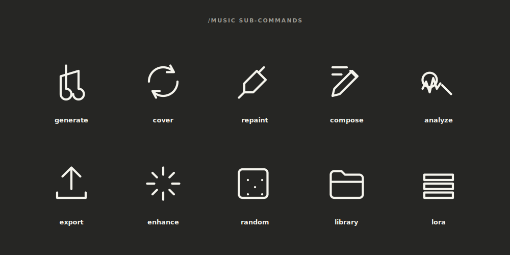
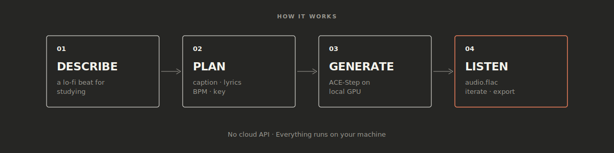
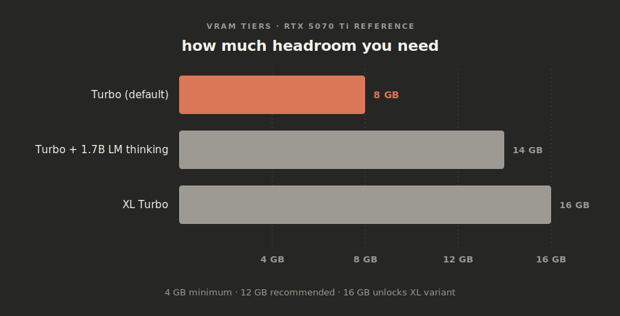
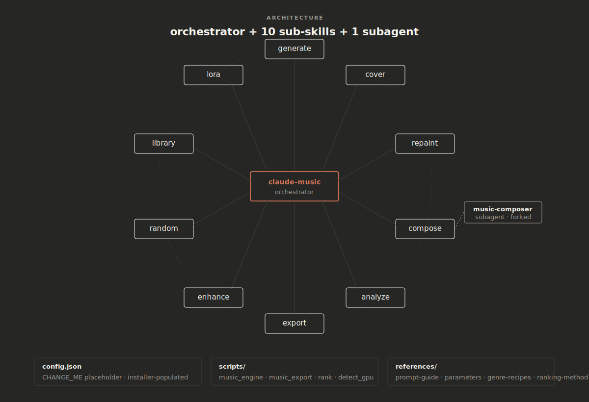

<p align="center">
  
</p>

# claude-music

AI music production skill for [Claude Code](https://claude.ai/code), powered by [ACE-Step 1.5](https://github.com/ace-step/ACE-Step-1.5).

Generate full songs, covers, remixes, and more — just by describing what you want.

<p align="center">
  
</p>

## Quick Start (5 minutes)

**You only need to run ONE command.** The installer handles everything else.

### Step 1: Download this skill

Open a terminal and paste:

```bash
git clone https://github.com/AgriciDaniel/claude-music.git
cd claude-music
```

### Step 2: Run the installer

**Linux / macOS**:
```bash
bash install.sh
```

**Windows** (PowerShell, Developer Mode or Admin):
```powershell
powershell -ExecutionPolicy Bypass -File .\install.ps1
```

The installer will:
- Check your system (GPU, Python, FFmpeg)
- Install ACE-Step 1.5 if you don't have it (asks first)
- Download the AI models (~5GB, asks first)
- Configure everything automatically
- Link the skill to Claude Code

**That's it.** No config files to edit. No terminal commands to memorize.

### Step 3: Make music

Open Claude Code (CLI, Desktop app, or VS Code) and say:

> "Generate a chill lo-fi beat, 60 seconds"

Or:

> "Make me a pop song about summer with female vocals"

Or use the command directly:

```
/music generate --caption "upbeat pop, female vocal, catchy" --duration 60
```

## What You Can Do

| Say this... | What happens |
|-------------|-------------|
| "Make me a song about..." | Generates a full song with vocals |
| "Create an instrumental jazz piece" | Instrumental generation |
| "Make a rock cover of this song" | Style transfer from reference audio |
| "Fix the chorus, make it more energetic" | Edits just that section |
| "Export for Spotify" | Loudness-optimized, platform-ready file |
| "Surprise me with something random" | Random genre, instant generation |

## Requirements

- **Claude Code** — [Get it here](https://claude.ai/code) (CLI, Desktop, or VS Code extension)
- **NVIDIA GPU** — 4GB+ VRAM minimum, 8GB+ recommended
  - No GPU? It works on CPU too, just much slower
- **Storage** — ~10GB free (for ACE-Step + AI models)

The installer handles everything else (Python, FFmpeg, uv, ACE-Step).

## Features

- **10 Sub-Skills**: generate, cover, repaint, compose, export, analyze, enhance, random, library, lora
- **50+ Languages**: English, Spanish, Chinese, Japanese, Korean, and more
- **Quality Presets**: draft (~15s) to max (~5min) — pick your speed/quality tradeoff
- **Platform Export**: Spotify, YouTube, TikTok, podcast, CD — one command each
- **LoRA Training**: Fine-tune on 3-10 songs for your own custom style
- **30+ Genre Recipes**: Built-in knowledge of optimal settings per genre
- **Safety**: No overwrites, VRAM management, disk space checks

## Quality Presets

<p align="center">
  
</p>

| Preset | Speed | Best for |
|--------|-------|----------|
| `--quality draft` | ~15s | Quick ideas, exploring (4 variants) |
| `--quality standard` | ~15s | Default, everyday use (2 variants) |
| `--quality high` | ~25s | Better lyrics/structure |
| `--quality max` | ~3-5min | Highest quality possible |

## Commands Reference

<p align="center">
  
</p>

```
/music generate   — Create music from text + lyrics
/music cover      — Remake a song in a different style
/music repaint    — Edit a section of a song
/music compose    — Songwriting help (lyrics, caption, BPM)
/music export     — Export for Spotify/YouTube/TikTok/etc
/music analyze    — Check BPM, key, loudness
/music enhance    — Normalize, denoise, separate stems
/music random     — Random generation (surprise me!)
/music library    — Browse your generated music
/music lora       — Train custom styles
/music setup      — Check if everything works
```

## How It Works

<p align="center">
  
</p>

1. You describe what you want (or use `/music generate`)
2. Claude crafts the right caption, lyrics, and parameters
3. ACE-Step 1.5 generates the audio locally on your GPU
4. You listen, iterate, and export

No cloud API. No subscription. Everything runs on your machine.

## GPU Requirements

<p align="center">
  
</p>

| Setup | VRAM | Speed |
|-------|------|-------|
| Turbo (default) | ~8GB | ~15 seconds |
| Turbo + Thinking | ~14GB | ~25 seconds |
| XL (best quality) | ~16GB | ~30 seconds |

## Uninstall

```bash
cd claude-music
bash uninstall.sh
```

Removes skill links only. Your generated music and ACE-Step are untouched.

## Architecture

<p align="center">
  
</p>

<details>
<summary>Click to expand file tree (for developers)</summary>

```
claude-music/
├── .claude-plugin/         # Plugin manifest (Dec 2025 open standard)
│   ├── plugin.json
│   └── marketplace.json
├── .github/workflows/      # CI — ruff, shellcheck, pytest, JSON validation
├── install.sh              # Interactive installer (Linux / macOS)
├── install.ps1             # PowerShell installer (Windows)
├── uninstall.sh            # Clean removal
├── pyproject.toml          # Python project metadata (dev + ranking deps)
├── ARCHITECTURE.md         # Why Python API over REST, orchestrator layout
├── LICENSE                 # MIT
├── CONTRIBUTING.md         # How to add genre recipes, run tests, PR checklist
├── SECURITY.md             # Threat model + vuln reporting
├── CODE_OF_CONDUCT.md      # Contributor Covenant v2.1
├── CITATION.cff            # Machine-readable citation
├── tests/                  # GPU-free contract tests (pytest)
│   └── test_music_engine.py  # 13 tests: presets, JSON contract, cover-mode mapping, security guards
├── research/               # Plan-driven research deliverables
│   ├── theme-9-anthropic-rubric.md
│   ├── theme-10-refactor-plan.md
│   └── theme-10-architecture-diff.md
└── skills/
    ├── claude-music/            # Main orchestrator
    │   ├── SKILL.md
    │   ├── config.json          # Auto-configured by installer
    │   ├── scripts/             # 8 scripts: music_engine.{py,sh}, music_export.sh, rank.py (stub), detect_gpu.sh, preflight.sh, check_deps.sh, setup.sh
    │   ├── references/          # 8 on-demand docs (prompt, genres, params, theory, structures, post-proc, LoRA, ranking-method)
    │   └── agents/              # 1 subagent: music-composer (opus, forked-context)
    └── claude-music-*/          # 10 sub-skill directories
```

See [ARCHITECTURE.md](ARCHITECTURE.md) for the Python-API-vs-REST decision and other design choices.

</details>

## For contributors

```bash
pip install -e ".[dev]"
pytest tests/            # 13 contract tests, <1s, no GPU required
ruff check skills/ tests/
```

See [CONTRIBUTING.md](CONTRIBUTING.md) for the full workflow and PR checklist, and [SECURITY.md](SECURITY.md) for the threat model + how to report vulnerabilities.

## What's new in v0.2

- Plugin manifest (`.claude-plugin/plugin.json` + `marketplace.json`) for the Dec 2025 Agent Skills open standard.
- GPU-free test suite with regression guards for the cover-mode parameter fix (`src_audio` + `cover_noise_strength`).
- CI pipeline: ruff + shellcheck + pytest + JSON validation.
- Windows installer (`install.ps1`) matching the bash installer.
- `ARCHITECTURE.md` documenting the Python-API-over-REST decision.
- `rank.py` stub + `references/ranking-method.md` (infrastructure for Theme 3 batch-and-rank).
- `agents/music-composer.md` subagent for Opus-powered composition planning in forked context.
- Source attribution on every reference doc.
- `--help` now works even when ACE-Step isn't configured yet (bug fixed during test scaffolding).

## License

MIT — see [LICENSE](LICENSE). Generated audio inherits no licensing obligations from this skill; consult ACE-Step's license.

## Credits

- [ACE-Step 1.5](https://github.com/ace-step/ACE-Step-1.5) by ACE Studio / Timedomain + StepFun.
- Built for [Claude Code](https://claude.ai/code) by Anthropic.
- Architectural patterns lifted from the [anthropics/skills](https://github.com/anthropics/skills) reference set and sibling projects [claude-seo](https://github.com/AgriciDaniel/claude-seo) and [claude-blog](https://github.com/AgriciDaniel/claude-blog).
